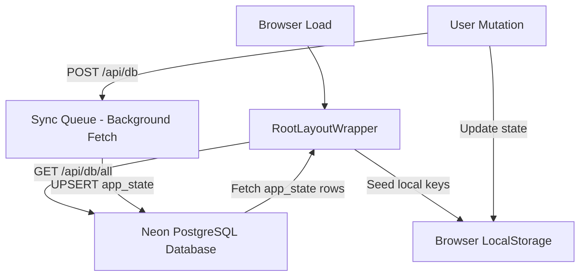

# Coaching OS

Coaching OS is a high-fidelity, multi-tenant SaaS educational management platform designed for tuition centers, coaching academies, competitive exam preparation institutes, and private tutoring organizations. It provides a unified, local-first dashboard to coordinate student lifecycle CRM, automated attendance tracking, fee invoicing, UPI QR payments, teacher payroll, parent communications, asset inventory, exam results ledger, and holidays scheduling.

---

## 🏢 Multi-Tenant & Role-Based Access Control (RBAC)

The platform implements strict data isolation using tenant scoping (`inst_001`, `inst_002`, `inst_003`) and provisions role-specific dashboards, navigation links, and administrative capabilities.

### User Roles & Navigation Scopes

| Role | Scope & Permissions |
| :--- | :--- |
| **Super Admin** | Platform-wide administration. Manages active tenant spaces, subscription billing tiers, global limits, and system-wide database sync audit logs. |
| **Institute Owner** | Executive control over a single tenant workspace. Manages students, teachers, batches, credentials, assets, fee structures, expenses, HR payroll, exam results, holiday calendars, and branding settings. |
| **Teacher** | Scoped academic access. Marks attendance for assigned batches, views class timetables, logs syllabus progress, publishes/edits exam scores for their classes, and tracks salary payouts. |
| **Student** | Personal student portal. Tracks class schedules, monitors attendance logs, views personal exam scorecards with progress trajectories, and reviews/pays outstanding fee invoices. |
| **Parent** | Linked student portal. Monitors their child's attendance ratings, checks class schedules, views school holiday calendars, inspects academic report cards with teacher remarks, and completes online fee invoice payments. |

---

## 🚀 Key Modules & Features

### 1. Bento-Grid Analytics Dashboards
* **Role-Specific Adaptation**: Dashboards dynamically adapt to the logged-in role (Owner, Teacher, Student, Parent) to render relevant KPIs.
* **Financial Metric Cards**: Tracks total income, monthly recurring revenue, pending fees, and estimated fee leakage.
* **Operational Widgets**: Renders active student enrollments, batch counts, classroom schedules, and quick actions.

### 2. Student Directory CRM & Profiles
* **Lifecycle Management**: Tracks student enrollments, batches, profiles, and statuses (*Active*, *On Leave*, *Suspended*).
* **Detailed Profile Pages**: Displays academic progress, attendance percentage charts, active fee invoices, and guardian contact details.
* **Roster Export**: Supports exporting student records to CSV format for external analysis.

### 3. Teacher Directory
* **Instructor Profiles**: Stores teacher credentials, subject specializations, contact information, and active status.
* **Salary Allocation**: Logs monthly base salary configurations and hourly rate metrics.

### 4. Batch & Timetable Manager
* **Classroom Allocation**: Manages classroom programs, subjects, capacities, colors, and schedules.
* **Drawer-Based Student Management**: Direct management of students within a batch via the "Manage" button on every batch card. Admins can add new students from the tenant directory, remove existing students, track real-time capacity levels, and view current batch rosters.

### 5. Automated Attendance Engine
* **Batch-Wise Sheets**: Interface to mark batch attendance for specific dates.
* **Bulk Adjustments**: Supports bulk toggles to mark students as present, late, or absent.
* **Parent Broadcasting**: Option to send automated attendance alert notifications directly to parents.

### 6. Fee Ledger & Invoicing
* **Flexible Billing Structures**: Supports monthly, batchwise, and custom billing structures.
* **Invoicing Engine**: Generates professional PDF invoices containing tax breakdowns, discounts, and payment terms.
* **Receipts & Payment History**: Tracks payment dates, methods, and transaction references for completed receipts.

### 7. UPI QR Payments Integration
* **Dynamic UPI QR Generator**: Generates a UPI QR code dynamically based on the invoice amount and institute VPA settings.
* **Merchant Configurations**: Allows owners to set custom UPI IDs (VPA) and merchant names to receive direct bank settlements.
* **Online Receipt Verification**: Displays transaction reference fields for parents to submit payments, which owners can manually approve.

### 8. Asset & Resource Manager
* **Granular Inventory Registry**: Tracks physical resources such as whiteboards, laptops, pens, markers, and classroom accessories.
* **Distributed Quantities**: Manages item counts across four distinct states within a single asset record:
  * `Available`: Units sitting in inventory/store.
  * `In Use`: Units currently allocated to classrooms or staff.
  * `In Repair`: Units undergoing maintenance or servicing.
  * `Deprecated`: Decommissioned or damaged units.
* **Allocation Distribution Bar**: Displays segmented, color-coded visual progress bars indicating real-time quantity splits.
* **Activity Logs & Audit Trail**: Persists history records capturing operations (Create, Update, Allocate, Maintenance, Decommission, Delete) with timestamps, operator info, and detailed description strings.
* **CSV Exports & Purge**: Enables downloading the entire inventory audit trail as a CSV file, with options to clear log histories.
* **Mobile Responsiveness**: Renders a compact card grid layout on mobile screens and an administrative table on desktop viewports.

### 9. Broadcast Communication Center
* **Template Editor**: Selects pre-defined message templates (Attendance Alert, Fee Reminder, Holiday Notice, Welcome Message) or composes custom messages.
* **Placeholder Resolution**: Automatically resolves dynamic placeholders like `[Student Name]`, `[Batch Name]`, `[Month]`, and `[Date]` at runtime.
* **Multi-Channel Dispatch**:
  * **App Notifications**: Creates real-time notifications saved in the tenant scope.
  * **Email Alerts**: Logs message dispatches.
  * **WhatsApp Redirects**: Cleans phone numbers, auto-prepends the country code (`91` for Indian numbers if exactly 10 digits are provided), and triggers an external API redirect link containing prefilled resolved text messages.
* **WhatsApp Group Hub**: Persists batch-wise WhatsApp group invite links. Allows owners to quickly modify links, track member counts, and open external group invites.

### 10. Secure Credential Manager
* **Tenant Identity Control**: Secure dashboard for Owners and Super Admins to provision, modify, and delete local portal login accounts.
* **Searchable Name Dropdown**: Custom lookup component that searches live tenant datasets (Students, Teachers, and Parents derived from student guardian fields) and automatically populates corresponding emails during creation.
* **Role Filters**: Tabs to organize credentials by All, Teachers, Students, and Parents.
* **Self-Deletion Protection**: Blocks logged-in administrative owners from deleting their own credentials to prevent lockouts.
* **Passcode Visibility Toggle**: Implements interactive eye/eye-off switches to inspect passwords securely.
* **Conflict Prevention**: Validates email unique constraints across the system to prevent overlapping logins.

### 11. HR & Teacher Payroll
* **Payroll Workspace**: Logs monthly base salaries, tracks extra hourly bonuses, and records leave requests.
* **Payslip Generator**: Generates professional PDF payslips for teachers, reflecting base pay, deductions, bonuses, and payment status.

### 12. Expenses & Bills Tracker
* **Operating Expense Logs**: Registers bills, rent payments, salary disbursements, and stationery purchases.
* **Financial Analytics**: Recharts charts demonstrating expenses broken down by categories and monthly comparisons.

### 13. Exam Results Ledger
* **Double-Sided Performance Portals**:
  * **Management View (Owners & Teachers)**: Features aggregated performance metrics (Total Exams, Class Average %, Pass Rate %, Toppers), interactive Recharts comparative batch-performance charts, and a comprehensive historical results ledger.
  * **Scorecard View (Students)**: Displays individual scorecards, subject-specific grade sheets, teacher remarks, and a Recharts progress trajectory chart comparing their scores to the class average.
  * **Report Card View (Parents)**: Displays the child's academic performance tracker, grades, teacher feedback, chronological progress charts, and comparative stats.
* **Interactive Scoresheet Drawer**: A step-by-step wizard to create and publish exams. Includes inputs for Subjective/Objective maximum marks, target batches, and scores.
* **Strict Batch Roster Scoping**: Automatically resolves target batch IDs and scopes the scoring sheet to display **only** students enrolled in that specific batch, ensuring data accuracy.
* **Database Sync & RBAC**: Integrated with Neon DB via JSONB sync, and strict role permissions.

### 14. Interactive Holidays Manager
* **Glassmorphic Countdown Banner**: A premium, visually striking ticker displaying a ticking clock and days count to the **Next Scheduled Holiday** (or displaying an ongoing break notice), boosting UX excitement.
* **KPI Metrics Cards**: Highlights key stats: *Total Holidays*, *Upcoming Closures*, *Longest Break* (vacation span), and *Emergency Closures*.
* **Interactive Monthly Calendar Grid**: A standard 42-day monthly grid that renders the days of the week, highlights today's date, and styles sibling month days in a muted color.
  * **Holiday Badges (Desktop)**: Renders colored horizontal badges directly inside cell grids for overlapping holidays, color-coded by category (National: rose, Academic: indigo, Regional: purple, Emergency: amber).
  * **Compact Dots (Mobile)**: Auto-collapses detailed text badges into small, clean colored indicator dots on mobile screens to prevent layout overflow.
  * **Interactive Date Selection**: Clicking a day highlights it and updates the selected day details panel immediately.
  * **Quick Add Trigger**: Clicking or double-clicking an empty grid day (as Owner) pre-populates the Start/End dates and launches the holiday scheduler modal.
* **Dual-View Workspace Tabs**: Allows users to toggle between **Calendar Grid** and a chronological **Timeline Ledger** for list-based analyses with search queries and category filters.
* **Daily Schedule Details Panel (Sidebar)**: A dedicated interactive panel showing full descriptions, date ranges, and categories for holidays falling on the selected date.
  * **Quick Action Controls (Owner Only)**: Renders **Edit** and **Retract** buttons for active holidays in the details list.
* **Seeded Category Distribution Metrics**: Renders visual progress bars detailing the distribution percentage of holidays across categories (National, Regional, Academic, Emergency, Other) on the timeline tab.
* **Overlap & Date Range Safety Engine**:
  * Enforces that End Date is on or after Start Date (`endDate >= startDate`).
  * Displays a real-time warning banner inside the dialog if the newly input dates overlap with another scheduled closure.
* **Role-Based Protection Gate**: Renders the identical visual layout (countdown ticker, KPI cards, calendar, timeline, search) but **strictly read-only** for Teachers, Students, and Parents, hiding administrative actions (Add, Edit, Delete, quick-add cues) from the DOM.

### 15. Centralized System Settings
* **Tenant Branding**: Configure institute name, tagline, custom logo text, and operational settings.
* **System Rules**: Customize payment configurations, current academic sessions, and default credentials.

### 16. Super-Admin Console
* **Tenant Provisioning**: Add, edit, or suspend institute sub-tenant accounts.
* **Subscription Billing**: Manages global subscription plans and tier limits.
* **System Logs**: Audits background database synchronization calls.

---

## 🔄 Local-First Database Sync Engine

Coaching OS employs a Local-First Synchronization pattern to deliver a fast, offline-capable user interface:



1. **Bootstrap Seeding**: During initial application mount, the [root-layout-wrapper.tsx](file:///c:/wamp64/www/coaching-os/src/components/root-layout-wrapper.tsx) component fires a `GET` request to `/api/db/all`. This loads all state records from the Neon PostgreSQL database and caches them into the browser's `localStorage` namespace.
2. **Synchronous Reads**: Pages retrieve data synchronously using scoped helper functions (e.g., `getScopedData`) located inside [tenant.ts](file:///c:/wamp64/www/coaching-os/src/lib/tenant.ts).
3. **Non-Blocking Writes**: Mutative edits call `setScopedData`. This updates the local storage cache immediately and asynchronously pushes a background `POST` request to `/api/db` to update the Neon database. The UI remains active and responsive without waiting for server responses.

---

## 📂 Project Directory Structure

```bash
coaching-os/
├── docs/                      # Architectural design specifications & JSON schemas
├── public/                    # Static assets, favicon, and system logos
├── scripts/                   # DB migrations and seeding scripts
│   └── db-init.js             # Initializes Neon PostgreSQL app_state schema
└── src/
    ├── app/                   # App Router pages, layouts, and API routes
    │   ├── api/
    │   │   ├── db/            # Receives background database mutations
    │   │   └── db/all/        # Initial data sync bootstrap fetcher
    │   ├── assets/            # Resource & Asset Management page
    │   ├── attendance/        # Automated attendance tracker sheet
    │   ├── batches/           # Batch and timetable setup sheets
    │   ├── communications/    # Broadcast center with WhatsApp & notification dispatch
    │   ├── credentials/       # Workspace credentials manager
    │   ├── expenses/          # Operational expenses logging tracker
    │   ├── fees/              # Student billing ledgers & invoice creator
    │   ├── holidays/          # Monthly calendar & holiday timeline manager
    │   ├── hr/                # Instructor payroll workspace & leave logger
    │   ├── login/             # Dynamic login portal routes for all roles
    │   ├── notifications/     # Scoped system audit alerts and messages
    │   ├── online-payments/   # UPI QR payment profiles and gateway verifications
    │   ├── results/           # Exam results publisher & student scorecards
    │   ├── schedule/          # Timetable calendar modules
    │   ├── settings/          # Tenant setup & branding controls
    │   ├── students/          # Student directory & academic profiles
    │   ├── super-admin/       # Platform-wide management console
    │   ├── teachers/          # Instructor directory & profiles
    │   ├── layout.tsx         # Root layout definition & viewport settings
    │   └── page.tsx           # Entry page router (landing page or dashboards)
    ├── components/            # Shared React components
    │   ├── ui/                # UI primitives
    │   ├── app-sidebar.tsx    # Multi-tenant custom navigation sidebar
    │   ├── layout-header.tsx  # Dynamic dashboard app navbar
    │   ├── root-layout-wrapper.tsx # Auth verification & database sync bootstrapper
    │   └── saas-landing-page.tsx  # B2B product marketing landing page
    └── lib/                   # Internal utilities and data persistence layers
        ├── db.ts              # Serverless Neon DB database connection pool
        ├── tenant.ts          # Core Multi-Tenant logic, storage keys, and mock data
        └── utils.ts           # CSS class merging tailwind helpers
```

---

## 🔑 Pre-Configured Demo Credentials

Use these credentials to test role scopes across pre-seeded tenant spaces. All accounts share the password: `demopassword`.

| Tenant Space | Role | Email Account | Name |
| :--- | :--- | :--- | :--- |
| **Global Platform** | Super Admin | `admin@coachingos.com` | Platform Admin |
| **Coaching OS Academy** | Institute Owner | `owner@coachingos.edu` | John Doe |
| | Teacher | `sarah.smith@coachingos.edu` | Prof. Sarah Smith |
| | Student | `sarah.smith@example.com` | Sarah Smith |
| | Parent | `parent@example.com` | Parent Account |
| **Apex Science Institute**| Institute Owner | `owner@apexscience.edu` | Dr. Arthur Apex |
| | Teacher | `priya.sharma@apexscience.edu` | Dr. Priya Sharma |
| | Student | `sarah.apex@apex.edu` | Sarah Apex |
| | Parent | `parent@apex.edu` | Parent Account (Apex) |
| **Horizon Prep Academy** | Institute Owner | `owner@horizonprep.edu` | Principal Horizon |
| | Teacher | `anita.desai@horizonprep.edu` | Anita Desai |
| | Student | `sarah.horizon@horizon.edu` | Sarah Horizon |
| | Parent | `parent@horizon.edu` | Parent Account (Horizon) |

---

## ⚙️ Local Setup Instructions

### 1. Requirements
* **Node.js** (v18.0.0 or higher)
* An active **Neon PostgreSQL database** instance (or a local PostgreSQL server).

### 2. Configure Environment Variables
Create a `.env` file in the project root directory and define your connection string:
```env
DATABASE_URL="postgresql://neondb_owner:<your_password>@<your_host>/neondb?sslmode=require"
```

### 3. Install Project Dependencies
Run this command in the project root:
```bash
npm install
```

### 4. Bootstrap the Database
Create the database schema tables and seed the baseline demo tenants and credentials:
```bash
node scripts/db-init.js
```

### 5. Launch the Development Server
```bash
npm run dev
```
Open [http://localhost:3000](http://localhost:3000) (or the port specified in the console output) in your web browser to run the application.
