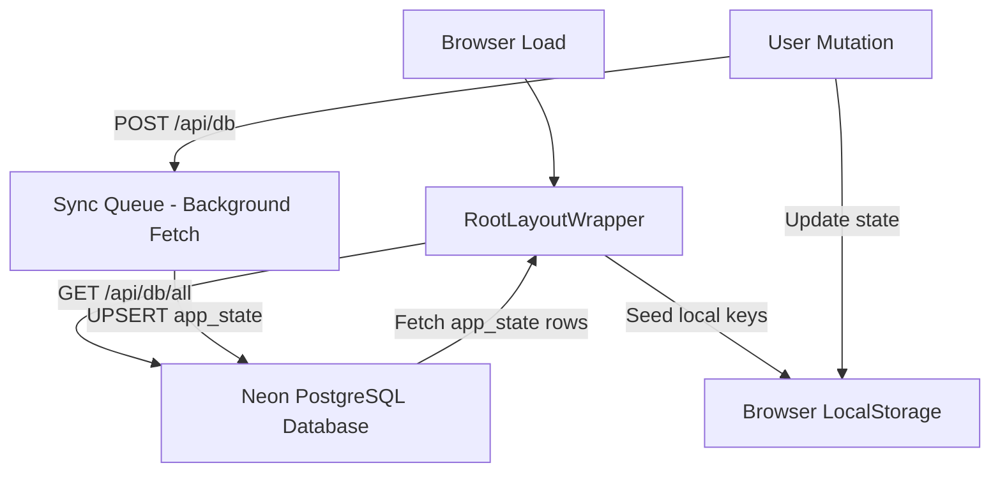

# Coaching OS

Coaching OS is a premium B2B multi-tenant SaaS educational management platform designed for tuition centers, coaching institutes, competitive exam prep centers, academies, and private tutors. It replaces spreadsheets, registers, and fragmented apps with a unified system to coordinate student lifecycle management, attendance logs, fee collections, teacher payrolls, parent communications, and operations analytics.

---

## 🚀 Key Features

* **Multi-Tenant Dashboard Analytics**: Role-specific, high-fidelity Bento Box widgets showing students counts, class schedules, financial income metrics, expense logs, and estimated fee leakage analytics.
* **Student Lifecycle CRM**: Full student database featuring academic profile pages, batch logs, guardian info, enrollment states, and CSV roster exports.
* **Batch & Timetable Manager**: Organizes classroom programs, subject subjects, instructors, capacities, colors, and schedules.
* **Automated Attendance Engine**: Batch-wise attendance sheets supporting bulk present/late/absent checks, history lookup, and parent notification broadcasts.
* **Advanced Fee Ledger & Invoicing**: Custom billing cycles (monthly, batchwise), pending balance tracking, automated notifications, digital PDF invoice generators, and receipts node.
* **Online Payments Integration**: Virtual payment gateway with dynamic UPI QR code generator, bank settlement profiles, and online receipt verifications.
* **HR & Teacher Payroll Workspace**: Tracks staff salaries, logs leaves, manages daily/monthly payouts, and compiles detailed monthly payslips.
* **Broadcast Communication Center**: Real-time message templates for exam grades, outstanding bills, class updates, and check-in logs with Direct WhatsApp redirects.
* **Centralized System Settings**: Institute details configuration, system-wide preference rules, active session controls, and platform billing dashboards for Super Administrators.

---

## 🛠️ Tech Stack

* **Frontend**: Next.js 15 (App Router, Tailwind CSS, TypeScript)
* **Icons & Visuals**: Lucide React
* **Charts**: Recharts
* **Document Export**: html2pdf.js
* **Database**: Neon PostgreSQL Serverless
* **AI Core Integration**: Google Genkit & Gemini 2.5 Flash

---

## 🔄 Local-First Database Sync Engine

Coaching OS operates on a **Local-First Synchronization architecture** to provide a fast, responsive user interface:



1. **Bootstrap Initialization**: On initial load, the client boot script inside [root-layout-wrapper.tsx](file:///c:/wamp64/www/coaching-os/src/components/root-layout-wrapper.tsx) makes a `GET` request to `/api/db/all` to retrieve all keys in the database and populate the browser's `localStorage` cache.
2. **Synchronous Reads**: All pages and components query data synchronously using local-first calls via `getScopedData` inside [tenant.ts](file:///c:/wamp64/www/coaching-os/src/lib/tenant.ts).
3. **Asynchronous Background Sync**: Mutative actions invoke `setScopedData` or other saving helpers. These write directly to `localStorage` and fire an asynchronous background `POST` request to `/api/db` to update the Neon PostgreSQL table, preventing UI blockages.

---

## 📂 Project Directory Structure

```bash
coaching-os/
├── docs/                      # Architectural blueprints and JSON schemas
├── public/                    # Global media assets, icons, and logo assets
├── scripts/                   # DB migrations and seeding files
│   └── db-init.js             # Seeds Neon PostgreSQL app_state tables
└── src/
    ├── ai/                    # Genkit engine and AI configuration
    │   └── genkit.ts          # Google Genkit plugin settings
    ├── app/                   # App Router pages and API routes
    │   ├── api/
    │   │   ├── db/            # Background database mutations receiver
    │   │   └── db/all/        # Initial data synchronization puller
    │   ├── layout.tsx         # Main layout definition & favicon settings
    │   ├── page.tsx           # Entry page router (renders dashboards or landing page)
    │   ├── login/             # Login credentials page
    │   ├── students/          # Student directory & [id] profile pages
    │   ├── teachers/          # Instructor directory & profiles
    │   ├── batches/           # Dynamic batches management pages
    │   ├── attendance/        # Attendance tracker sheet
    │   ├── schedule/          # Timetable calendar modules
    │   ├── fees/              # Invoices ledgers & receipts builder
    │   ├── online-payments/   # UPI QR profiles and gateway tracker
    │   ├── hr/                # Payroll workspaces & leaves logger
    │   ├── expenses/          # Rent & bills logging tracker
    │   ├── communications/    # Template broadcast messaging center
    │   ├── notifications/     # Audit alerts logs
    │   └── settings/          # Tenant setup & platform billing controls
    ├── components/            # Reusable React components
    │   ├── ui/                # Shadcn primitives
    │   ├── app-sidebar.tsx    # Multi-tenant custom navigation sidebar
    │   ├── layout-header.tsx  # Dynamic dashboard app navbar
    │   ├── root-layout-wrapper.tsx # Auth verification & db sync initializer
    │   └── saas-landing-page.tsx  # Premium conversion-focused B2B landing page
    └── lib/                   # Utility libraries and multi-tenant logic
        ├── db.ts              # Serverless Neon DB connection exporter
        ├── tenant.ts          # Core Multi-Tenant logic & generator mocks
        └── utils.ts           # CSS merging tailwind helpers
```

---

## 🏢 Multi-Tenant & RBAC Model

Data within Coaching OS is isolated using **scoped key prefixing** inside the database schema:
* Key structure: `${tenantId}_${baseKey}` (e.g. `inst_001_students`).
* Global keys (like `tuitionflow_tenants` or `tuitionflow_user_credentials`) govern platform-wide settings.

### User Roles & Navigation Access

1. **Super Admin**: Manages all sub-tenants, tracks global platform billing tiers, and monitors database connection audit logs.
2. **Institute Owner**: Full administrative access to the active tenant space (Students, Salaries, Expenses, Payments, Settings).
3. **Teacher**: Scoped access to mark attendance for assigned batches, view scheduling calendars, and view payslip status.
4. **Student**: View enrolled classes, trace syllabus targets, and pay outstanding fee invoices online.
5. **Parent**: View child's class schedule, check attendance scores, and complete online invoice payouts.

---

## 🔑 Pre-Configured Demo Credentials

To test different role scopes across the pre-seeded tenant spaces, use the baseline credentials below (Password is `demopassword` for all):

| Tenant Space | Role Scope | Email Account | Name |
| :--- | :--- | :--- | :--- |
| **Global Platform** | Super Admin | `admin@coachingos.com` | Platform Admin |
| **Coaching OS Academy** | Institute Owner | `owner@coachingos.edu` | John Doe |
| | Teacher | `sarah.smith@coachingos.edu` | Prof. Sarah Smith |
| | Student | `sarah.smith@example.com` | Sarah Smith |
| | Parent | `parent@example.com` | Parent Account |
| **Apex Science Institute**| Institute Owner | `owner@apexscience.edu` | Dr. Arthur Apex |
| | Teacher | `priya.sharma@apexscience.edu` | Dr. Priya Sharma |
| | Student | `sarah.apex@apex.edu` | Sarah Apex |
| | Parent | `parent@apex.edu` | Parent Account (Apex) |
| **Horizon Prep Academy** | Institute Owner | `owner@horizonprep.edu` | Principal Horizon |
| | Teacher | `anita.desai@horizonprep.edu` | Anita Desai |
| | Student | `sarah.horizon@horizon.edu` | Sarah Horizon |
| | Parent | `parent@horizon.edu` | Parent Account (Horizon) |

---

## ⚙️ Local Setup Instructions

### 1. Requirements
Ensure you have **Node.js (v18 or higher)** and an active **Neon PostgreSQL database** instance.

### 2. Configure Environment Variables
Create a `.env` file in the root directory and specify your Neon database URL connection string:
```env
DATABASE_URL="postgresql://neondb_owner:<your_neon_password>@<your_host>/neondb?sslmode=require&channel_binding=require"
```

### 3. Install Dependencies
```bash
npm install
```

### 4. Initialize and Seed the Database
Seed the PostgreSQL database with the single table schema and baseline demo tenants dataset:
```bash
node scripts/db-init.js
```

### 5. Start the Development Server
```bash
npm run dev
```
Open [http://localhost:9002](http://localhost:9002) in your browser to view the application.
